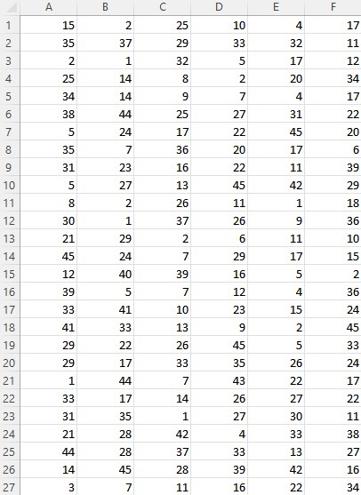

# <p align="center">💸 Lottery_Checker </p>

## <p align="center">🥇 Program Description</p>
```
This program helps you to compare multiples of the lottery number you 
purchased to this week's target number once and tell you the result.
```

## <p align="center">⛏️ Demo</p>
<p align="center">

</p>


## <p align="center">♎ To install library</p>
```
- pyinstaller
- bs4
- openpyxl
- lxml
- requests
```

## <p align="center">📖 Instruction</p>


### <p align="center">Generate a `.exe` file</p>
```
0. Make sure you installed the libraries above
1. Open your terminal on the `lottery_checker` folder
2. Type the `pyinstaller -w -F .\lottery_checker.py` command on terminal
    - `-w`: Open window instead of terminal
    - `-F`: Generate a program directly without other extra files
3. Click `dist` folder just generated
4. Execute `lotter_checker` program
```

### <p align="center">Create and fill out the excel file</p>
```
0. Create a excel file(name the file however you want)
1. Fill out the tables
    - Every row means one lottery, and every column means one number in a lottery
2. Save the excel file
```

### <p align="center">Run the program </p>
```
0. Press `파일 찾기` button
1. Select the excel file that you filled out with lottery numbers
2. Look at how many jackpots you got!
```

## <p align="center">⚡ Cautions In Use </p>
```
- You need to make sure that what you wrote on the excel file is 100% correct!!
```
