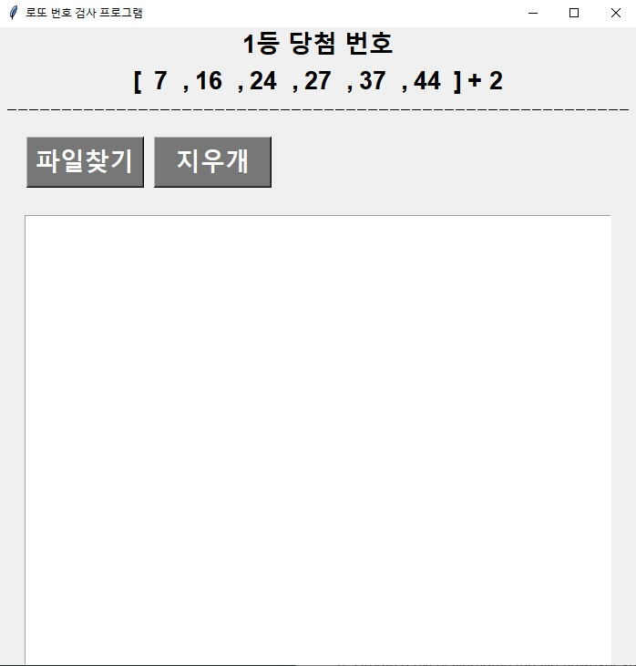

# 💰 Lottery_Checker

## 📖 Program Description
```
This program helps you to compare multiples of the lottery number you purchased to this week's target number once and tell you the result.
```

## 🖼️ Demo



## ♎ To install library
- pyinstaller
- bs4
- openpyxl
- lxml
- requests

## 🔖 Instruction


### Generate a `.exe` file
0. Make sure you installed the libraries above
1. Open your terminal on the `lottery_checker` folder
2. Type the `pyinstaller -w -F .\lottery_checker.py` command on terminal
    - `-w`: Open window instead of terminal
    - `-F`: Generate a program directly without other extra files
3. Click `dist` folder just generated
4. Execute `lotter_checker` program

### Create and fill out the excel file
0. Create a excel file(name the file however you want)
1. Fill out the tables
    - Every row means one lottery, and every column means one number in a lottery
2. Save the excel file

### Run the program
0. Press `ÆÄÀÏ Ã£±â` button
1. Select the excel file that you filled out with lottery numbers
2. Look at how many jackpots you got!

## ⚡ Cautions In Use
- You need to make sure that what you wrote on the excel file is 100% correct!!
